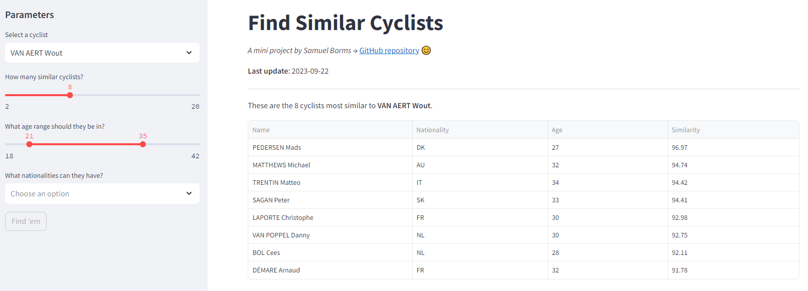

# Cyclist Similarity Tool

[](https://github.com/sborms/cyclingsimilarity.com/actions/workflows/cicd.yaml)
[](https://cyclingsimilarity.streamlit.app)
[](https://medium.com/@sborms/aws-streamlit-and-collaborative-filtering-a-simple-recipe-for-finding-comparable-cyclists-63327970fe64)
[](https://github.com/psf/black)
[](https://python-poetry.org)

This is the backbone repository for a mini project dubbed `cyclingsimilarity.com`. The _.com_ website doesn't really exist (yet) as it's more meant as a quirk, but the main output is an actual Streamlit web application which is hosted [here](https://cyclingsimilarity.streamlit.app). You can use it to discover similar cyclists. It is in some sense a "productionized" version of a Dash app I developed previously, which is [here](https://github.com/DataWanderers/find-a-similar-pro-cyclist). Natural extensions to the project include finding similar races or teams.

<p align="center">  </p>

## Repository setup

For completeness, this is an overview of the repository structure and some of the associated steps to set it up. You can of course simply clone the repository and get started from there if you are familiar with projects like these. The structure is inspired from [this](https://github.com/datarootsio/ml-skeleton-py), [this](https://github.com/datarootsio/python-minimal-boilerplate) and [this](https://github.com/nogibjj/mlops-template).

Poetry simplifies overall dependency management. In your GitHub repository directory, run following commands to add Poetry (after having installed it first, see Google!):
- `poetry init`
- `poetry config virtualenvs.in-project true`
    - If you want to create your virtual environment folder directly in your project as `.venv/` (comes in handy if your IDE is Visual Studio Code)
- `poetry add $(cat requirements.txt)` (adds dependencies to the `pyproject.toml` file and downloads them) or `poetry install` (simply installs all dependencies, for instance when you cloned the repository)
    - Alternatively, add all packages manually using `poetry add <package_name>`
- `poetry shell` to activate the virtual environment
    - Run `exit` to get out of the virtual environment

To enable the pre-commit framework, do:
- `pre-commit install`

For files like `Makefile`, `.pre-commit-config.yaml`, and the `Dockerfile`s you can copy over the contents and modify where needed. The other folders are populated with the required data, notebooks, scripts, dependencies and other useful files. Apart from the top bit, the `.gitignore` is the Python template from GitHub.

This is a brief explanation of the various subfolders:

### .github

Has the GitHub Actions CI/CD workflow specifications.

### api

This is the `FastAPI` backend. A Docker image is deployed to AWS ECR, the container runs with AWS ECS on Fargate. The various API endpoints are consumed by the frontend.

### assets

Stores some repository trivia. Don't bother.

### data

Has some temporary data for playing around locally. _Not pushed to GitHub._

### notebooks

Has the Jupyter Notebooks used for data exploration and model development. Have a look at the outputs to get a feel for the data and the model.

### scripts

Has a `scrape.py` and a `train.py` script. The first one scrapes the data from [procyclingstats.com](https://www.procyclingstats.com/), the second one fits the cyclist and race embeddings.

### src

A central place for code used across all other components of the project.

### tests

Houses the unit tests.

### webapp

This is the `Streamlit` frontend, which is deployed to **Streamlit Cloud**. Changes are automatically pushed but you need to reboot the app to display the newest version.

## Main technologies


## AWS infrastructure

The following AWS cloud resources are used to support the project:
- **S3** for storing several artifacts
- **Elastic Container Registry (ECR)** for storing Docker images (in this case the Docker image for the FastAPI backend)
- **Elastic Container Service (ECS)** of type **Fargate** for running a Docker container
- **Application Load Balancer (ALB)** for routing traffic to the Fargate task(s)

## Deployment commands

Below are a set of useful commands for containerized deployment. To push a Docker image to an AWS ECR repository, check out the specified push commands in the AWS management console.

This builds the FastAPI application.

```bash
docker build -t api -f api/Dockerfile .
docker run -p 8000:8000 api
```

This builds the Streamlit application.

```bash
docker build -t webapp -f webapp/Dockerfile .
docker run -p 8501:8501 webapp
```

Make sure to have the backend running before starting the Streamlit app. You can use Docker Compose to (build and) run both containers simultaneously.

```bash
docker-compose up -d
```

## Useful links

These links will help you set up the cloud resources on AWS and deploy FastAPI and Streamlit applications:
- https://www.youtube.com/watch?v=o7s-eigrMAI (great video!)
- https://beabetterdev.com/2023/01/29/ecs-fargate-tutorial-with-fastapi
- https://repost.aws/knowledge-center/ecs-fargate-static-elastic-ip-address
- https://www.eliasbrange.dev/posts/deploy-fastapi-on-aws-part-2-fargate-alb
- https://testdriven.io/blog/fastapi-streamlit
- https://davidefiocco.github.io/streamlit-fastapi-ml-serving
